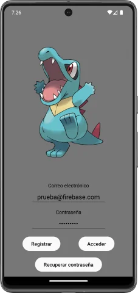
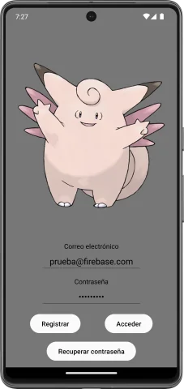
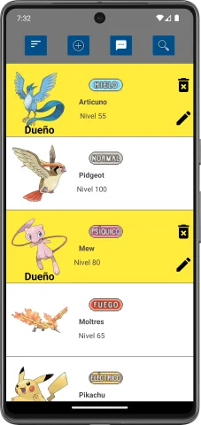
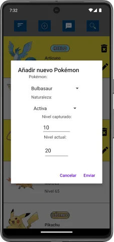
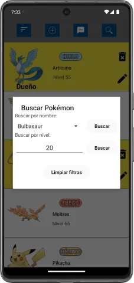
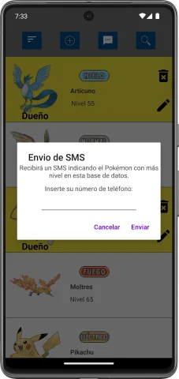

# Pokémon Storage

**Pokémon Storage** is a shared Pokémon storage system. It allows you to have
your own pokémon, view other users' pokémon, search and sort the database.

The project was built using **Kotlin** in **Android Studio** and
**Google Firebase** database.

> [!NOTE]  
This application was developed during my time as a student, under a tight
deadline and while managing other projects. It offers the core functionality,
but you may encounter bugs, rough edges, and code that’s not production-ready.

# Media

  
  
  
  
  
  

